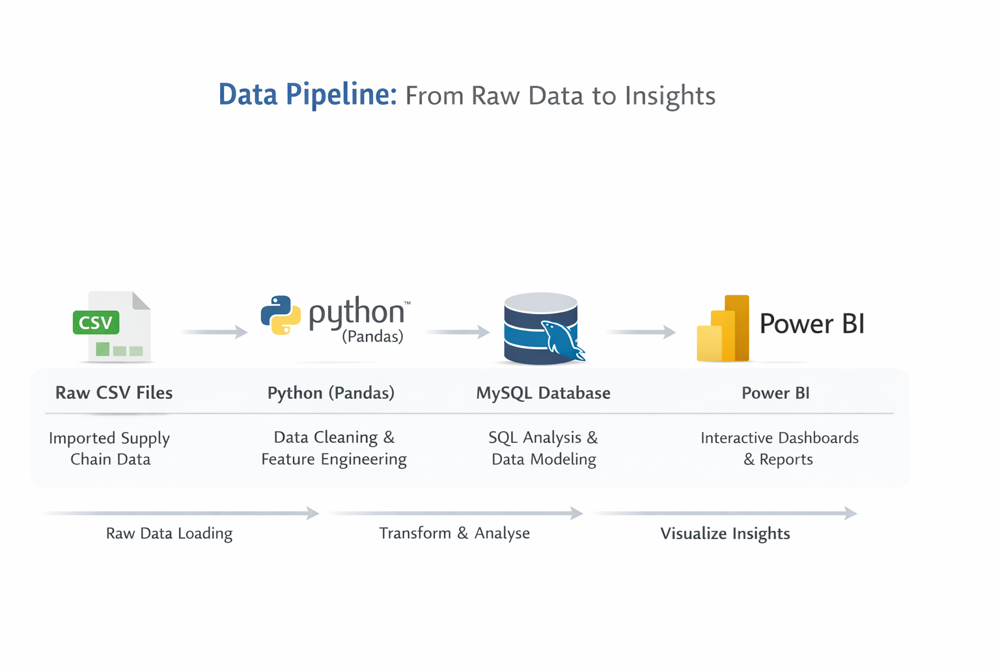
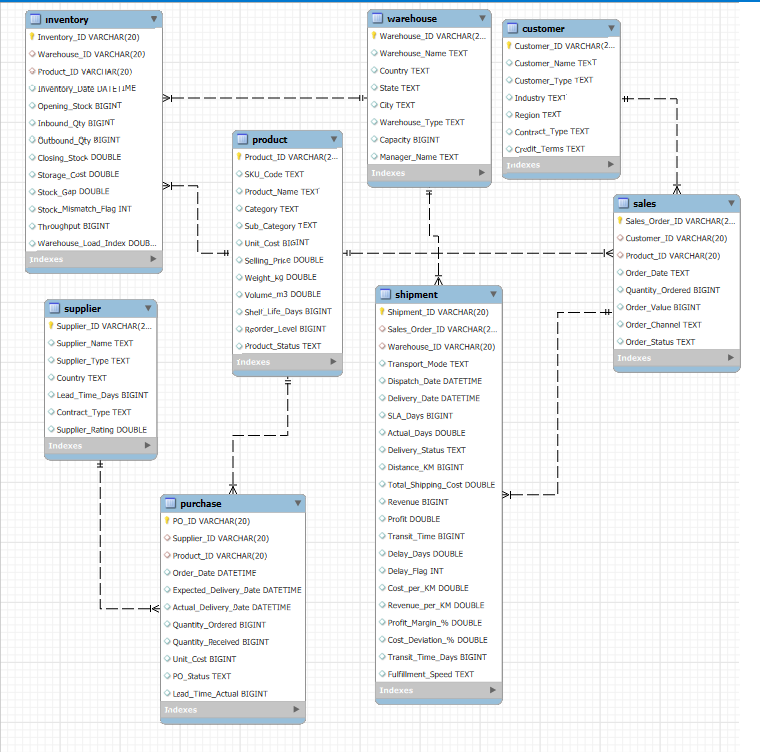
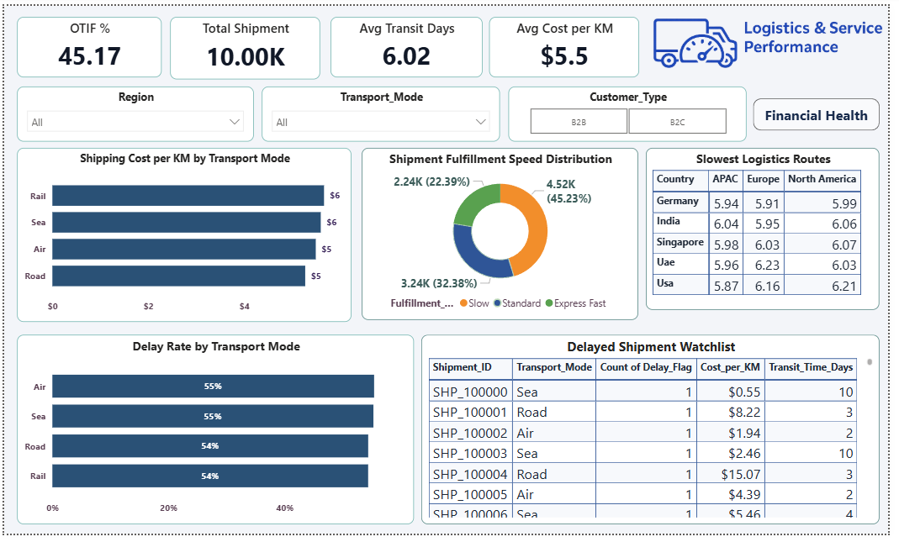
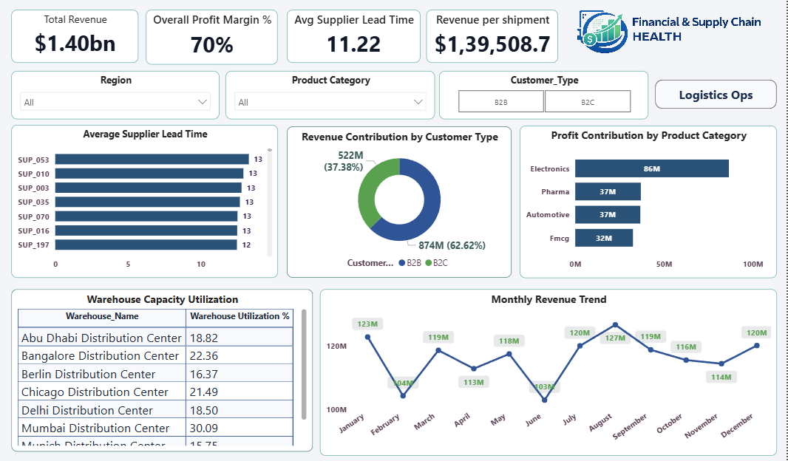

# 🚚 Global Supply Chain Performance Intelligence

---

## 1) Project Title

**Global Supply Chain Performance Intelligence – End-to-End Analytics**

---

## 2) Summary

During the analysis period, the supply chain processed ~10,000 shipments and generated $1.40B revenue. However, OTIF is 45.17%, significantly below the ~95% industry benchmark, indicating a need to improve delivery reliability.

Operationally, the average transit time is 6.02 days and transport cost is $5.5/km, both currently within acceptable limits but requiring ongoing monitoring. Financial performance remains strong with a 70% profit margin and $139.5K average revenue per shipment. Supplier average lead time is 11.22 days, which is reasonable but has room for optimization.

---

## Table of Contents

- [Overview](#3-overview)  
- [Problem Statement](#4-problem-statement)  
- [Dataset](#5-dataset)  
- [Tools and Technologies](#6-tools-and-technologies)  
- [Data Pipeline](#7-data-pipeline)  
- [Methods](#8-methods)  
- [Key Insights](#9-key-insights)  
- [Data Model View](#10-data-model-view)  
- [Project Visualizations](#11-project-visualizations)  
- [How to Run This Project](#12-how-to-run-this-project)
- [Business Recommendations](#13-business-recommendations)
- [Results and Conclusion](#14-results-and-conclusion)  
- [Author and Contact](#author-and-contact)

---

## 3) Overview

This project delivers an end to end supply chain analytics solution designed to provide clear visibility into key operational and financial performance metrics. It enables business stakeholders to monitor delivery reliability, logistics cost efficiency, supplier performance, warehouse utilization, and shipment profitability in a centralized view.

The solution integrates Python for data preparation, MySQL for analytical storage, and Power BI for interactive visualization, ensuring timely and data-driven decision-making across the supply chain function.

---

## 4) Problem Statement

The organization faces challenges in:
- The company operates a complex global supply chain involving multiple suppliers, warehouses, transport modes, and customer segments.
- On-Time Delivery (OTIF) performance is significantly below the industry benchmark, indicating delivery reliability issues.
- Transportation costs show risk of increase and require better monitoring and optimization.
- Supplier lead times are inconsistent, impacting procurement planning and inventory availability.
- Warehouse activity and shipment profitability lack clear, centralized visibility.
- Current reporting is mostly reactive, making it difficult to quickly identify delays, high-cost routes, and operational risks.

**Objective:**
- Track and optimize logistics cost efficiency, including cost per KM analysis.
- Evaluate supplier reliability through lead time performance metrics.
- Provide visibility into warehouse utilization and inventory health.
- Support faster, proactive, and data driven decision-making across the supply chain.
## 5) Dataset

The dataset contains global shipment, supplier, warehouse, and customer information.

**Key data domains:**
- improved_dim_customer
- improved_dim_product
- improved_dim_warehouse
- raw_dim_supplier
- raw_fact_inventory
- raw_fact_purchase
- raw_fact_sales
- raw_fact_shipment

_This dataset is used for analytical and educational purposes._

---

## 6) Tools and Technologies

- **Python (Pandas)** — data cleaning & feature engineering  
- **MySQL** — data modeling & SQL analysis  
- **Power BI** — interactive dashboards  
- **Jupyter Notebook** — development environment  

---

## 7) Data Pipeline

The project follows a structured data pipeline from raw data to insights.

### 🔄 Pipeline Flow



**Pipeline Steps:**

1. Raw CSV ingestion  
2. Data cleaning & feature engineering (Python)  
3. Data modeling & KPI analysis (MySQL)  
4. Interactive dashboards (Power BI)

---

## 8) Methods

- Data cleaning and preprocessing  
- Feature engineering (Transit Time, Delay Flag, Cost/KM, Profit Margin)  
- SQL-based KPI calculations  
- Transport and route performance analysis  
- Supplier lead-time evaluation  
- Dashboard-driven business analysis  

---

## 9) Key Insights

- OTIF performance significantly below benchmark  
- Delay risk distributed across all transport modes  
- North America routes show slightly higher transit times  
- B2B contributes majority of revenue  
- Overall shipment profit margin remains strong (~70%)  
- Supplier lead time averages ~11 days with improvement opportunity  

---

## 10) Data Model View

The relational model was designed in MySQL to enable efficient analytics and joins across supply chain entities.

### 🗂️ Model Diagram



## 11) Project Visualizations

### Logistics & Service Performance Dashboard



### Financial & Supply Chain Health Dashboard



---

## 12) How to Run This Project

```bash
# Clone the repository
git clone <repository-url>

# Navigate to the project folder
cd supply-chain-analytics

# Install dependencies
pip install -r requirements.txt

# Open notebook
jupyter notebook
```

---

## 13) Business Recommendations
1. Improve OTIF Performance 
Current OTIF is below the desired benchmark. Implement weekly tracking, investigate delay root 
causes (transport inefficiencies, warehouse dispatch), and target 90%+ OTIF to improve service 
reliability. 
2. Optimize Transport Mode Usage 
Since delay risk is similar across modes, focus on route-level optimization and carrier performance 
review. Use air/road selectively for urgent shipments and prioritize sea/rail for cost efficiency. 
3. Address Slow Logistics Lanes 
High transit times in specific origin destination lanes require network redesign, alternate routing, 
or carrier renegotiation. Continuously monitor lane KPIs to reduce variability. 
4. Strengthen Supplier Lead-Time Control 
Lead-time variability impacts planning. Develop a supplier scorecard, review underperforming 
vendors, and consider contract renegotiation or secondary sourcing for risk mitigation. 
5. Diversify Revenue Mix 
B2B drives the majority of revenue. Continue strengthening B2B while expanding B2C 
opportunities to reduce dependency risk and improve revenue quality. 
6. Balance Warehouse Utilization 
Uneven warehouse loads indicate capacity risk. Optimize inventory allocation and capacity 
planning, and closely monitor high-load facilities during peak periods. 

---

## 14) Results and Conclusion

The project successfully built a scalable supply chain analytics framework providing clear visibility into delivery performance, logistics costs, supplier reliability, and profitability.

The dashboards highlight critical improvement areas — particularly OTIF performance and supplier consistency — while confirming strong financial health. This solution demonstrates how structured analytics can enable **proactive, data-driven supply chain optimization**.

---

## Author and Contact

**Supesh**  
Data Analyst | Python | SQL | Power BI | Excel | Supply Chain Analytics  

📧 Email: supeshmurhekar993@gmail.com  
🔗 LinkedIn: https://www.linkedin.com/in/supesh-murhekar-792b45253/
